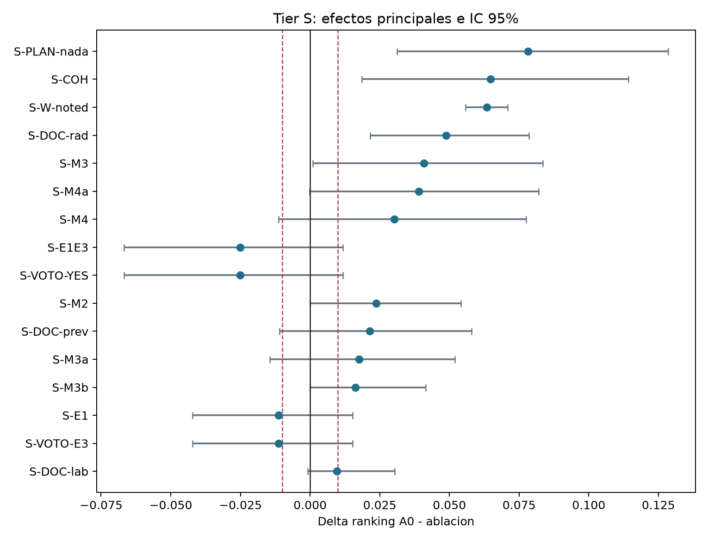
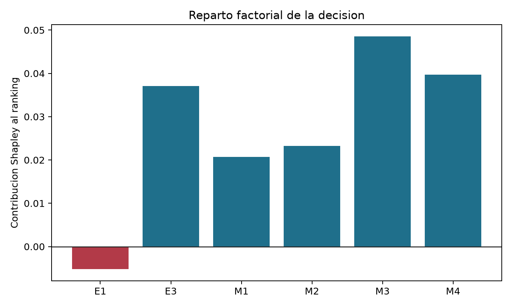
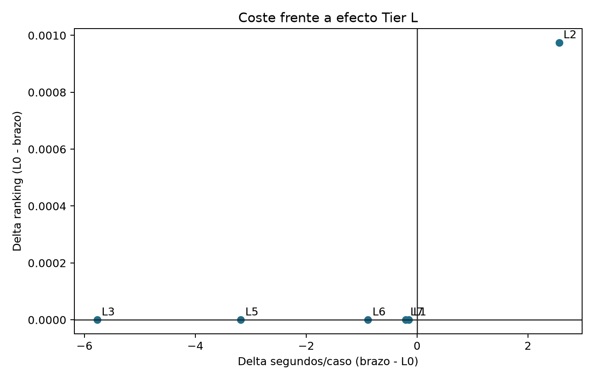
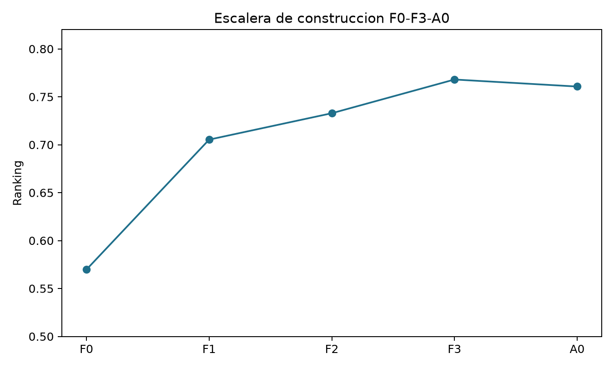

# Informe final del estudio de ablacion T1

Fecha: 2026-09-23. Modo primario: `honest`. Casos etiquetados: 91.

## Resumen ejecutivo

La referencia obtuvo ranking `0.760707` y 74/91 decisiones correctas. Ningun brazo Tier L cambio una decision. El margen narrativo observado fue `delta_N=0.030000`. Todos los numeros de la tabla proceden de `results/tabla_maestra.json`.

| ID | Intervencion | Veredicto | Delta ranking [IC95] | F: max abs(Delta) | N: Delta [IC95] | Delta s/caso | Confianza |
|---|---|---|---:|---|---|---:|---|
| N03 | EXPERT-STRUCTURED (E1) | **INDETERMINADA** | -0.011396 [-0.042267, 0.015175] | 0.013699; INDETERMINADA_F | no medido | n/a | media |
| N04 | EXPERT-COHORT | **INDETERMINADA** | 0.064801 [0.018626, 0.114158] | 0.023077; INDETERMINADA_F | no medido | n/a | media |
| N05 | EXPERT-EXPERIENCE (biblioteca kNN) | **SOBRA_DF (N sin medir)** | 0.000000 [0.000000, 0.000000] | 0.000000; SOBRA_F | no medido | n/a | media |
| N06 | EXPERT-TRACE (E4) | **NECESARIA_F** | 0.063395 [0.055855, 0.070811] | 0.766868; NECESARIA_F | no medido | n/a | alta |
| N07 | EXPERT-EAU (+ RAG) | **INDETERMINADA** | 0.000000 [0.000000, 0.000000] | 0.000000; SOBRA_F | -0.029730 [-0.067568, 0.008108]; INDETERMINADA_N | -0.15 | media |
| N08 | MODERATOR | **NECESARIA_F** | 0.000975 [-0.000475, 0.002694] | 0.049550; NECESARIA_F | -0.010811 [-0.047297, 0.028378]; INDETERMINADA_N | 2.56 | alta |
| N09 | EXPERT-IMAGE | **SOBRA** | 0.000000 [0.000000, 0.000000] | 0.000000; SOBRA_F | 0.000000 [0.000000, 0.000000]; SOBRA_N | n/a | alta |
| N10 | REGISTRAR (+ MCP) | **NECESARIA_F** | 0.078200 [0.031195, 0.128538] | 0.198317; NECESARIA_F | no medido | n/a | alta |
| N11 | EXPERT-PSA (E2) | **SOBRA_DF (N sin medir)** | 0.000000 [0.000000, 0.000000] | 0.000000; SOBRA_F | no medido | n/a | media |
| N12 | EXPERT-FUSION (E3) | **INDETERMINADA** | 0.008046 [-0.003091, 0.029094] | 0.013699; INDETERMINADA_F | no medido | n/a | media |
| N13 | PANEL-PROTOCOL | **ESTRUCTURAL** | n/a | n/a; ESTRUCTURAL | no medido | n/a | alta |
| N14 | VERIFIER (+ reapertura) | **SOBRA** | 0.000000 [0.000000, 0.000000] | 0.000000; SOBRA_F | -0.000450 [-0.011261, 0.010360]; SOBRA_N | -5.77 | alta |
| N15 | CHAIR | **INDETERMINADA** | 0.000000 [0.000000, 0.000000] | 0.000000; SOBRA_F | 0.025676 [-0.016216, 0.068919]; INDETERMINADA_N | -3.18 | media |
| M1 | Cohorte sin biopsia previa, PI-RADS mayor o igual a 3 | **INDETERMINADA** | 0.001236 [0.000000, 0.003091] | 0.013514; INDETERMINADA_F | no medido | n/a | media |
| M2 | Cohorte con biopsia negativa, PI-RADS mayor o igual a 4 | **INDETERMINADA** | 0.023743 [0.000000, 0.054124] | 0.000000; SOBRA_F | no medido | n/a | media |
| M3 | Cohorte con biopsia positiva | **INDETERMINADA** | 0.040790 [0.001021, 0.083521] | 0.007353; INDETERMINADA_F | no medido | n/a | media |
| M4 | Grado documentado | **INDETERMINADA** | 0.030199 [-0.011333, 0.077601] | 0.007353; INDETERMINADA_F | no medido | n/a | media |
| M5 | Voto ponderado E1 y E3 | **INDETERMINADA** | -0.025033 [-0.066830, 0.011699] | 0.034247; INDETERMINADA_F | no medido | n/a | media |
| M6 | Peso de biblioteca igual a cero | **INDETERMINADA** | 0.027794 [-0.001236, 0.064658] | 0.014085; INDETERMINADA_F | no medido | n/a | media |
| M8 | Confianza por acuerdo | **INDETERMINADA** | -0.000618 [-0.003091, 0.001854] | 0.006757; INDETERMINADA_F | no medido | n/a | media |
| M9 | Pesos del formulario de E4 | **NECESARIA_F** | 0.063395 [0.055855, 0.070811] | 0.766868; NECESARIA_F | no medido | n/a | alta |
| M10 | Plan de documentos de E4 | **NECESARIA_F** | 0.001791 [-0.000636, 0.004287] | 0.082207; NECESARIA_F | no medido | n/a | alta |
| M11 | Guardia de aterrizaje | **NECESARIA_F** | 0.008326 [0.007010, 0.009681] | 0.178250; NECESARIA_F | no medido | n/a | alta |
| M12 | Excepcion de bx | **NECESARIA_F** | 0.000173 [-0.002187, 0.002460] | 0.159588; NECESARIA_F | no medido | n/a | alta |
| M13 | Documentos individuales del plan | **NECESARIA_F** | 0.048832 [0.021576, 0.078542] | 0.189090; NECESARIA_F | no medido | n/a | alta |
| G1 | Guardia de valores sin fuente | **SOBRA** | 0.000000 [0.000000, 0.000000] | 0.000000; SOBRA_F | -0.001351 [-0.012162, 0.008108]; SOBRA_N | -0.88 | alta |
| G2 | Guardia de grados sin fuente | **SOBRA** | 0.000000 [0.000000, 0.000000] | 0.000000; SOBRA_F | -0.001351 [-0.012162, 0.008108]; SOBRA_N | -0.88 | alta |
| G3 | Guardia de lenguaje de proceso | **NECESARIA_N** | 0.000000 [0.000000, 0.000000] | 0.000000; SOBRA_F | 0.044144 [0.028829, 0.060360]; NECESARIA_N | -0.20 | alta |
| G6 | Filtros del moderador | **NECESARIA_F** | 0.000975 [-0.000475, 0.002694] | 0.049550; NECESARIA_F | -0.010811 [-0.047297, 0.028378]; INDETERMINADA_N | 2.56 | alta |

## Metodo

Se compararon predicciones por caso con el evaluador oficial. Tier S uso simulacion determinista, bootstrap pareado de 10.000 remuestreos, McNemar exacto con Holm y Wilcoxon sobre aciertos comunes. Tier L mantuvo modelo, temperatura y perfil de vLLM fijos. Tier N promedio tres pasadas del juez oficial en una sola residencia Ollama y uso el replicado L0/L0p para fijar el margen de equivalencia.

## Decision y formulario

La escalera honesta fue F0 `0.5697`, F1 `0.7053`, F2 `0.7329`, F3 `0.7680` y A0 `0.7607`. E3 tuvo Shapley `0.0371` y E1 `-0.0052`.

L2 cambio plan/pesos en 34 casos y L4 en 23, pero sus deltas de ranking fueron 0.0009745 y 0.0000912. El resto de brazos fue identico a L0 en D/F.

## Narrativa e integridad

El juez evaluo tres veces cada brazo. La replica produjo EE `0.000000`. La auditoria sin juez encontro 3 grados sin fuente en L6 y lenguaje de proceso en 2 notas de L7; L0 tuvo cero violaciones.

## Honest frente a deployed

El ranking `honest` fue `0.7607` frente a `0.8390` en `deployed`. La diferencia se interpreta como optimismo por haber entrenado expertos con las etiquetas, no como capacidad transferible al test.

## Hipotesis pre-registradas

| H | Estado | Evidencia |
|---|---|---|
| H1 | **indeterminada** | S-COH: delta ranking 0.0648, IC95 [0.0186, 0.1142], McNemar-Holm p=0.5371; signo DEV/VAL positivo. |
| H2 | **indeterminada** | S-M4: delta ranking 0.0302, IC95 [-0.0113, 0.0776], McNemar-Holm p=1; signos DEV/VAL opuestos. |
| H3 | **indeterminada** | Voto honesto 15/27 frente a si constante 18/27; delta ranking A0-si -0.0829, IC95 [-0.2174, 0.0317]. |
| H4 | **confirmada** | Shapley ranking E3=0.0371 y E1=-0.0052. |
| H5 | **confirmada** | S-PSA-off: 0 filas distintas y delta cero en D, ranking y los cinco componentes. |
| H6 | **confirmada** | Pesos constantes noted: delta ranking 0.0634. Abrir todo: delta tool 0.0818. Ambos brazos se clasifican NECESARIA_F. |
| H7 | **refutada** | S-LIB-off: 0 filas distintas y delta cero en todos los componentes; no aparece la bajada F prevista. |
| H8 | **confirmada** | L0 reproduce exactamente D/F y el plan del ejecutor determinista Tier S. |
| H9 | **indeterminada** | N07: INDETERMINADA (INDETERMINADA_N). |
| H10 | **refutada** | N08: D SOBRA_D; F NECESARIA_F. |
| H11 | **confirmada** | Cero reaperturas y cero cambios de decision. |
| H12 | **confirmada** | EXPERT-IMAGE tuvo 0 activaciones en 91 casos. |
| H13 | **indeterminada** | N15: D/F SOBRA_D/SOBRA_F; N INDETERMINADA_N. |
| H14 | **parcial** | Sin G1-G2 aparecen 3 grados sin fuente; sin G3 aparecen 2 notas con lenguaje de proceso. El efecto medio N se informa por separado. |
| H15 | **confirmada** | Sin M11: variable_weight mejora 0.0378, grounding cae 0.1782 y el neto favorece a la guardia en 0.00833 de ranking. |
| H16 | **confirmada** | A_min: delta ranking 0.0000. |

## Ablacion conjunta

A_min retiro: N09, N14, G1, G2. Brazo: `L9`. Delta ranking: `0.000000` con IC95 `[0.0, 0.0]`. H16: `confirmada`.

## Recomendaciones

- `N03`: mantener; evidencia insuficiente.
- `N04`: mantener; evidencia insuficiente.
- `N05`: no retirar sin medir narrativa.
- `N06`: mantener.
- `N07`: mantener; evidencia insuficiente.
- `N08`: mantener.
- `N09`: retirar o simplificar.
- `N10`: mantener.
- `N11`: no retirar sin medir narrativa.
- `N12`: mantener; evidencia insuficiente.
- `N13`: mantener.
- `N14`: retirar o simplificar.
- `N15`: mantener; evidencia insuficiente.
- `M1`: mantener; evidencia insuficiente.
- `M2`: mantener; evidencia insuficiente.
- `M3`: mantener; evidencia insuficiente.
- `M4`: mantener; evidencia insuficiente.
- `M5`: mantener; evidencia insuficiente.
- `M6`: mantener; evidencia insuficiente.
- `M8`: mantener; evidencia insuficiente.
- `M9`: mantener.
- `M10`: mantener.
- `M11`: mantener.
- `M12`: mantener.
- `M13`: mantener.
- `G1`: retirar o simplificar.
- `G2`: mantener por integridad aunque el efecto medio sea equivalente.
- `G3`: mantener por integridad aunque el efecto medio sea equivalente.
- `G6`: mantener.

## Sesgos y limites

1. Cohorte, grado y umbral se disenaron sobre estos mismos 91 casos; sus efectos son optimistas.
2. `honest` es out-of-fold, pero los hiperparametros de expertos tambien se eligieron en esta cohorte.
3. Con n=91, efectos de 1-3 decisiones quedan por debajo de la detectabilidad pre-registrada.
4. Solo se uso un modelo generador, T=0 y una residencia del juez; no mide variacion entre modelos.
5. Los 104 casos sin etiqueta no permiten estimar generalizacion ni cambio de distribucion.

## Figuras

## Fuentes

Resultados estructurados: `S_loo.json`, `S_factorial.json`, `L_efectos.json`, `J_efectos.json`, `N_audit.json`, `tabla_maestra.json`, `A_min.json` y `cierre.json`.
