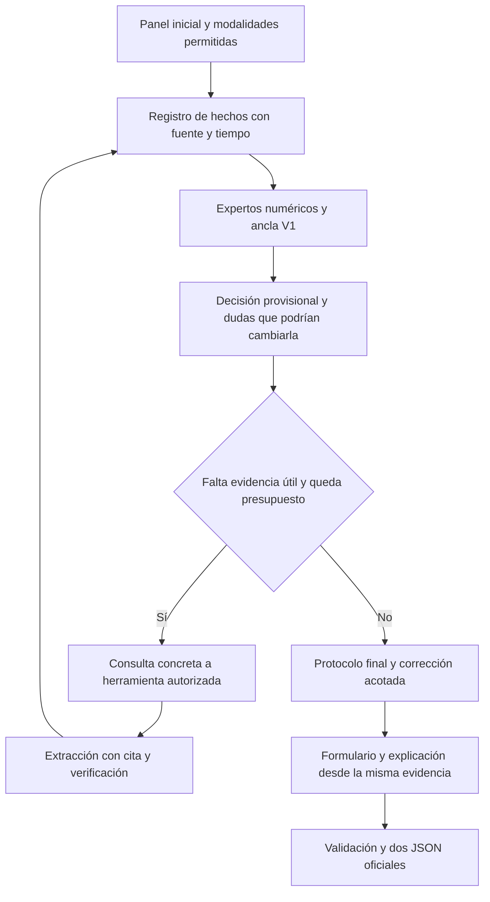

# CHIMERA V2 — una junta que comprueba qué podría cambiar su decisión

**Estado: PLAN. Fecha: 11-09-2026.** Se han revisado V1, los experimentos de ambas versiones, el evaluador y las restricciones locales; se ha ejecutado una auditoría descriptiva reproducible. Las arquitecturas y mejoras de este documento están **por implementar y medir**.

**Requisito obligatorio añadido:** arquitectura completa en una sola GPU de 16 GB, con CPU y hasta 32 GiB de RAM, sin inferencia externa. Pendiente de implementación y validación física; véase §13.1.

> **Avance 11-09-2026 — Fase A / E11 tramo 1: implementado y medido en ensayo preliminar.**
> El perfil de §13.1 existe en `runtime/resources.py`, está conectado al constructor real
> de `vllm.LLM` y se ha medido por esa ruta. Con la tarjeta recortada a 16 GiB el perfil
> de la V1.1 **no arranca el motor** (`ValueError`, pide 19 GiB) y el de V2 completa
> las tres interfaces en contenedor sin montar código, con **13 332 MiB** de pico
> bajo el techo de 14 336, conservando contexto 32 768, bf16 y todos los expertos,
> y con las **seis salidas byte a byte idénticas** a la V1.1. Estado: **pendiente de validación física**
> —el recorte es por lastre en una RTX 5090, no una GPU de 16 GB identificada—.
> Evidencia: [BITACORA_V2.md](BITACORA_V2.md) y `evaluation/reports/resources_16gb/`.
>
> **Corrección de premisa que este avance obliga a registrar:** el fallo de Development
> del 10-sep **no fue de memoria**, fue de **tiempo**. El correo de Grand Challenge dice
> que la inferencia seguía ejecutándose con normalidad al cortarse, y el `31.59x` de su
> log sólo cuadra con una A10G de 24 GiB, donde la memoria sobraba. El perfil de 16 GB
> es requisito del PLAN y desbloquea tarjetas pequeñas; **no cierra por sí solo el
> límite temporal**, que sigue siendo el riesgo vivo de la entrega.

## 1. La apuesta

**Conservar la junta clínica, pero cambiar su unidad de trabajo: de opiniones a hechos verificables y decisiones sometidas a contraste.**

V1 funciona porque separó el número de la prosa. Su límite es que gran parte de la deliberación no modifica la información que realmente usa el protocolo. Añadir otra voz sobre los mismos rasgos suele repetir o diluir lo que ya sabe el mejor experto. V2 hará que la deliberación pueda mejorar la decisión **corrigiendo una interpretación clínica o resolviendo una incertidumbre relevante**, con una cadena de evidencia que pueda verificarse en código.

La pregunta central de la junta será: **«¿Qué hecho desconocido o contradictorio tendría que resolver para cambiar esta decisión?»** El moderador transformará esa pregunta en una consulta concreta; un especialista aportará un dato con fuente; el protocolo recalculará y registrará si ese dato tuvo efecto. El presidente explicará el resultado de ese proceso.

Ejemplo sintético: «GG1» y «biopsia previa positiva» no dicen por sí solos si se está ante un diagnóstico inicial, una confirmación pendiente o un seguimiento ya estable. V2 representará esos estados y su evidencia temporal por separado. No impondrá la regla «estable implica no biopsiar»: aprenderá o validará si esa distinción mejora la tarea con los datos disponibles. Tampoco deducirá evolución del orden en que aparecen dos párrafos.

Tres cambios sustanciales:

1. **Una representación clínica verificable y temporal**, compartida como infraestructura por las tareas. Los modelos reciben hechos, fuentes, ausencias y conflictos explícitos.
2. **Una junta de contraste con consultas adaptativas y corrección acotada de V1.** La información nueva puede modificar la decisión; la elocuencia, el número de voces y la repetición de un dato no aumentan su peso.
3. **T3 con un riesgo continuo y una distribución de supervivencia**, separando orden, calibración temporal y evento. El contenedor calcula todo para un solo paciente con artefactos congelados de entrenamiento.

Esto es una hipótesis de diseño sustentada por fallos de mecanismo observados. No es una promesa de ganar puntos. Si los conceptos nuevos no añaden señal fuera de muestra, se conserva el predictor anterior y se aprovechan sólo las mejoras verificadas de extracción, trazabilidad o eficiencia.

## 2. Qué se conserva y qué se replantea

| Pieza | Decisión V2 | Razón |
|---|---|---|
| Pizarra y acta | Conservar, con hechos y cambios de estado estructurados | Permite reconstruir cada decisión |
| Especialistas por dominio | Conservar; diversidad por información y función | Tres modelos con la misma decisión no son tres evidencias independientes |
| Protocolo reproducible | Conservar | La salida numérica tiene que ser comprobable |
| Presidente LLM | Conservar como redactor y lector estructurado bajo verificación | El voto libre del LLM ya fue débil en los ensayos T1 |
| V1 como referencia | Conservar sus artefactos y configuración congelados | Facilita comparación y recuperación |
| Cascada rígida T1/T2 | Mantener de ancla; permitir una corrección pequeña medida | No destruir una regla fuerte para rescatar un caso histórico |
| Turnos fijos para todos | Sustituir por presupuestos y condiciones de parada | Una duda resuelta debe terminar la deliberación |
| Memoria de precedentes | Usar para preguntas/contrastes, con exclusión por grupo | La similitud superficial y el autoencuentro no prueban generalización |
| Formularios y consultas | Derivarlos de la misma evidencia que sustentó la decisión | Evitar una explicación y una traza que describan procesos distintos |
| T3 meses como transformación escalonada | Comparar con mapa continuo y supervivencia calibrada | Conservar resolución del riesgo y mejorar interpretación temporal |

No se copiará a V2 todo el árbol de corridas de V1. El diseño tiene una única implementación futura de cada componente, artefactos explícitos y un adaptador de entrada/salida. Durante este trabajo sólo se añaden el plan y sus evidencias a este directorio.

## 3. Punto de partida y objetivo medible

La [evidencia detallada](EVIDENCIA.md) distingue cuatro cosas que no se deben mezclar: ejecución del contenedor, ajuste sobre entrenamiento, predicción fuera de muestra y juicio de la explicación.

- V1 conserva 83/91 decisiones correctas T1 y 65/72 T2 en el histórico. T2 tiene dos casos `watchful_waiting`, ambos mal clasificados en esa corrida; no hay muestra para afirmar una sensibilidad estable de esa clase.
- T3 mejora de 0,73717 a 0,82345 de c-index en la estimación anidada histórica; el 0,88319 de la salida desplegada es dentro de muestra.
- El OVERALL mixto V1 con juez es 0,82616/0,82612. Es una referencia interna con selección histórica, no el rendimiento esperado garantizado del test.
- T3 paga parte de la mejora de orden con `time_score` anidado 0,75402→0,71206. V2 debe medir ambos y explicar cualquier compromiso.
- Declarar en T2 las consultas realmente realizadas cuesta aproximadamente **0,02002 de OVERALL** en el replay con la prosa histórica congelada. Por tanto, el 0,826 no se puede tratar como una base ya coherente con la traza real.

Se mantendrán dos referencias:

**H0, referencia histórica:** V1 exacta, sus JSON y sus limitaciones. Sirve para comprobar reproducción, no para atribuir cada variación a aprendizaje.

**B0, referencia operativa verificable:** V1 congelada con contratos de evidencia, lecturas y validación explícitos, y evaluación de la ruta utilizada para casos nuevos. Los cambios necesarios para que la traza describa la ejecución se publican como correcciones, aunque bajen el score. B0 se medirá antes de adoptar mejoras V2. Cada candidato se compara contra B0 y se informa también de la distancia a H0.

### Cómo se gana el ranking

Con el evaluador local fijado:

```text
R1 = (media_score_caso_T1 + F1_yes) / 2
R2 = (media_score_caso_T2 + F1_ponderado) / 2
R3 = c_index(meses, tiempos_observados, eventos_observados)
OVERALL = 0.4 R1 + 0.4 R2 + 0.2 R3

T1/T2, si la decisión es correcta:
score_caso = 0.20 confianza + 0.25 pesos_variables + 0.15 factores
           + 0.15 consultas + 0.05 grounding + 0.20 explicación
Si la decisión es incorrecta: score_caso = 0.
```

Apagar el juez cambia los pesos; no equivale a quitarle simplemente su término. Se importará siempre el evaluador para medir. Los promedios de componentes que publica se calculan en los casos que pasan la puerta; al estimar una ganancia se debe incluir esa puerta y recalcular F1. «Corregir un caso vale siempre X» no es una fórmula válida.

Como sensibilidad aritmética, subir R1 en 0,015, R2 en 0,025 y R3 en 0,020 suma **0,020 de OVERALL**. Son incrementos ilustrativos, no una previsión. El objetivo práctico será recuperar cualquier pérdida por correcciones de integridad y superar H0 en una comparación homogénea, además de mejorar B0. El cierre mínimo de calidad propone +0,010 de OVERALL frente a B0, sin regresión material en otra tarea; +0,020 es una meta ambiciosa. Ambos se confirmarán con el protocolo de la sección 10.

## 4. Arquitectura propuesta



### 4.1 Registro de hechos: una representación que puede comprobarse

Cada hecho tendrá un contrato interno semejante a éste —no se añade al esquema oficial—:

```json
{
  "concept": "histological_progression",
  "value": false,
  "status": "observed",
  "source": "pathology_report",
  "pointer": {"start": 0, "end": 28},
  "quote": "No histological progression.",
  "timepoint": "current_comparison",
  "subject": "patient",
  "method": "negation_parser_v2",
  "evidence_id": "fact-001"
}
```

Estados mínimos: `observed`, `unknown`, `conflicting`, `not_applicable`. En conceptos booleanos, una negativa documentada se representa como `value=false` y `status=observed`; un valor desconocido tiene `value=null`. El parser registra aparte el alcance de la negación que respalda el valor. Ausencia de mención no se transforma en negativa. Los offsets se refieren al texto fuente y su final es exclusivo.

El registro distinguirá:

- Valor estructurado y cita literal en informe; no reemplazar uno por otro en silencio.
- Diagnóstico humano y predicción de patología digital.
- Lesión, biopsia y pieza quirúrgica; estadio clínico y patológico.
- Pasado, momento de decisión y plan futuro; desconocimiento de fecha.
- Preferencia explícita, alternativa discutida y decisión previa. Una recomendación del expediente no se convierte automáticamente en la etiqueta a predecir.
- Dato no disponible, documento todavía no abierto y fallo de una herramienta.

Primero se usan campos estructurados y extractores deterministas mejorados. El LLM entra sólo para un concepto ambiguo o un fragmento que el parser no resuelve, con salida restringida a valor, fuente y cita. Si la cita no existe, mezcla sujetos o no respalda el concepto, se rechaza la propuesta. Una cita literal es necesaria pero no suficiente para validar su interpretación.

El control semántico se apoya en negación local, temporalidad y coherencia de campos, con revisión ciega de una muestra. Una segunda generación del mismo LLM no cuenta como confirmación independiente. Cada versión de parser/prompt y su tasa de error quedan en el artefacto.

**Presupuesto inicial de conceptos:** 8–12 por tarea, reutilizando lo existente. Se priorizan estado diagnóstico y seguimiento; progresión correctamente negada y fechada; discordancia de grado y fuente; hallazgos adversos; reserva funcional documentada; preferencias explícitas; suficiencia de la evidencia. No se añaden todas las posibles variables clínicas.

### 4.2 Dos memorias con funciones distintas

1. **Memoria clínica:** catálogo local de conceptos y fragmentos de guía, versionado. Dice qué debe comprobarse y en qué contexto es aplicable.
2. **Memoria de experiencia:** ejemplos de entrenamiento del pliegue actual. Sugiere una pregunta o una diferencia relevante. Cada precedente muestra también por qué no es equivalente al paciente actual.

La memoria de experiencia no devuelve decisiones por identidad ni meses de un vecino. Se excluye el grupo completo del paciente evaluado, también bajo otros IDs o tareas. Su índice, los prototipos y cualquier normalización se construyen sólo con train. Los textos del urólogo de entrenamiento pueden usarse como supervisión permitida, con procedencia declarada; nunca se leen las etiquetas ni explicaciones de validación para redactar la respuesta de ese paciente.

### 4.3 El contraste: volver a calcular, no discutir más

Cada experto devuelve internamente:

```text
distribución de decisión o riesgo
hechos usados y fuentes
dominio en el que puede operar
hechos ausentes que impedirían sostener su recomendación
```

El protocolo considera un pequeño conjunto de estados plausibles para conceptos desconocidos. Si todas las alternativas admisibles producen la misma acción, el hecho no merece una consulta por valor decisional. Si alguna cambia la acción, el moderador pide la fuente que podría resolverla. Se limita la enumeración a los dos conceptos prioritarios y hasta cuatro combinaciones coherentes por vuelta; no se hace un producto cartesiano de todo el expediente.

Esto es **sensibilidad del modelo a hechos observables**, no una estimación causal del beneficio de tratar o biopsiar. Nunca se cambia artificialmente una variable clínica para simular una intervención terapéutica y se presenta como resultado esperado.

El registro conserva `decision_before`, `question`, `source_requested`, `verified_facts_added`, `decision_after` y `reason_for_stop`. Permite medir cuántas consultas cambiaron realmente información o decisiones, y cuántas sólo produjeron texto.

### 4.4 Planificador de consultas

Arranque sencillo: reglas pequeñas por tarea y disponibilidad, más estimaciones de utilidad obtenidas con datos de entrenamiento. No entrenar un agente RL con 91/72 casos.

Para una sección `s`, valorar:

```text
U(s | evidencia_actual) = mejora esperada de decisión y explicación verificable
                         - coste de lectura y generación
                         - penalización esperada de consultas innecesarias
```

Es una función de diseño cuya estimación se validará; no se conoce de antemano. El planificador no puede usar contenido del documento antes de abrirlo, ni consultar un caché que ya incorpore ese contenido. Para estudiar su utilidad fuera de línea se reproducen prefijos reales de lectura y se enmascaran también las features derivadas de lo no leído.

Orden inicial: datos del panel → fuente que resuelve un conflicto → fuente que decide entre acciones. También puede consultar para respaldar un hecho esencial de la explicación. Parar cuando no exista una duda relevante resoluble, la utilidad sea insuficiente o se agote el presupuesto. Todas las lecturas efectivas se declaran, incluso si al final no cambian la decisión. No duplicar la misma fuente ni contar réplicas como nueva evidencia.

### 4.5 Corrección acotada de la decisión base

Se evaluarán exactamente dos alternativas al ancla:

- **Modelo pequeño sobre conceptos**, con regularización fuerte y como máximo unas pocas interacciones predefinidas.
- **Corrección residual**, que conserva la predicción del ancla y sólo aprende el aporte de los conceptos nuevos.

Para T1, cuando el ancla tenga una probabilidad estimada fuera de muestra:

```text
logit(p_V2) = logit(p_ancla) + corrección_regularizada(conceptos, conflictos)
```

No asignar 0,99 a una regla dura para inventar su probabilidad. Las ramas sin probabilidad necesitan calibración de su fiabilidad dentro de train o usan la variante con ancla categórica. El tamaño máximo de la corrección y la eventual compuerta se seleccionan sólo dentro del bucle de entrenamiento. El caso sin soporte vuelve al ancla y declara incertidumbre; no recibe una excepción inventada.

Para T2 se usa la versión multinomial con clases alineadas. Se aprende sobre **todos los pacientes de entrenamiento**, no sobre una lista de los siete errores conocidos. Para entrenar la corrección se generan predicciones cruzadas del ancla: usar sus probabilidades de entrenamiento haría que el corrector aprendiera residuos irreales.

La corrección necesita demostrar beneficio condicional: casos arreglados, casos dañados, soporte del subgrupo, cambios de F1 y cambios de score completo. No basta con que el experto alternativo tenga otra arquitectura o una AUC global aceptable.

## 5. Diseño específico de T1

**Problema a resolver:** la cascada tiene reglas fuertes, pero simplifica el estado clínico y depende de una extracción incompleta del grado y contexto del seguimiento. El plan de lectura aprendido puede omitir justamente el documento que resolvería un caso ambiguo.

1. Conservar la decisión V1 como ancla, incluidas sus diferencias entre biopsia ausente, negativa y positiva. No extender automáticamente sus guardias entre grupos.
2. Representar por separado diagnóstico conocido, contexto de vigilancia, confirmación documentada, cambio temporal y grado humano disponible. La negación y el origen del grado se validan antes de entrar al predictor.
3. Cuando falte un concepto que pueda cambiar la decisión, consultar `previous_notes` o el informe pertinente a través de MCP. Nunca concluir que no hay progresión porque no se abrió el informe.
4. Comparar el ancla, el modelo sobre conceptos y la corrección residual. Usar regresión logística regularizada o árbol muy pequeño como opciones cerradas; mantener el catálogo corto.
5. Mantener los bloques ABD como referencia. No volver a añadir MRI cruda al mismo Extra Trees. La rama multimodal conceptual de la sección 8 tiene una premisa distinta y será opcional.

Medir F1 de `yes`, especificidad, sensibilidad, matriz de confusión, ranking y consultas reales. El histórico contiene 6 falsos positivos y 2 falsos negativos; ello orienta la auditoría, no autoriza un umbral más conservador sin evaluar los falsos negativos que añade. Un texto del urólogo que contradiga su etiqueta se registra como discrepancia; no se cambia la etiqueta ni se elimina el paciente para subir métricas.

**Aceptación específica:** mejora de ranking fuera de muestra con las mismas particiones; balance positivo de cambios de decisión; sin pérdida material de sensibilidad. Si la aparente ganancia se concentra en un único caso o plantilla ya inspeccionada, queda como exploratoria. El subconjunto de ocho errores históricos es una prueba de regresión, nunca el conjunto de selección.

## 6. Diseño específico de T2

**Problema a resolver:** el grado ya explica mucho. Los casos difíciles exigen representar mejor estado clínico, aptitud y preferencias, y la ruta actual abre seis documentos de forma habitual aunque devuelve una traza vacía.

### 6.1 Primera apuesta: aprovechar el panel de verdad

El panel T2 contiene `note_sections`, antecedentes, medicación, IPSS, vida diaria y campos de biopsia. El lector de conceptos debe agotar esa información permitida antes de abrir EHR extendido. No se trata de simular una ejecución sin herramientas usando lo que se leyó en una corrida anterior.

Comparar tres políticas cerradas:

- **B0 completo:** lecturas originales declaradas correctamente.
- **Panel inicial:** predictor y redacción entrenados/evaluados sólo con ese panel; documentos inaccesibles.
- **Panel con consultas dirigidas:** abre una fuente si hay un conflicto o una distinción relevante pendiente.

En el histórico las 72 etiquetas T2 tienen `reveal_sequence` vacío; es una peculiaridad de las anotaciones, no prueba de que nunca se necesite una herramienta. No aprender una regla que prohíba consultar para maximizar el componente de herramientas. Si una consulta necesaria baja ese componente pero mejora decisión o fidelidad, medir el efecto completo y conservar una traza verdadera.

### 6.2 Separar tres preguntas clínicas

Representar por separado **enfermedad documentada**, **necesidad de intervención** y **aptitud/contexto del paciente**. La cascada V1 ya tiene nodos de cáncer/tratar/beneficio; V2 no los rebautiza como innovación. El cambio es que sus entradas serán conceptos verificables y que las dudas dirigirán la lectura.

Conceptos candidatos nuevos o corregidos: trayectoria humana con fechas; carga/patrones adversos documentados; limitación funcional explícita; preferencia y objetivo del paciente; discrepancia entre grado estructurado, humano narrativo y AI. Reutilizar los extractores existentes donde sean correctos. No llamar probabilidad de supervivencia individual a una fórmula de comorbilidad aproximada ni usar edad sola como sustituto de fragilidad.

Los cuatro nombres de salida conservan el significado del contrato y de las anotaciones. **No equiparar automáticamente `continued_surveillance` con «ya estaba en active surveillance»**: en este corpus incluye decisiones que el protocolo asocia a biopsia sin cáncer. Se documentarán los usos con datos de train antes de aprender el mapeo de estados a clases.

La clase `watchful_waiting` sólo tiene dos etiquetas. Mantener la posibilidad de emitirla cuando la evidencia y el protocolo validado lo sostengan; publicar los dos resultados individualmente en el análisis protegido. No prometer una cabeza específica bien calibrada, no inventar pacientes independientes mediante SMOTE y no aumentar artificialmente su soporte con ejemplos sintéticos de estilo.

### 6.3 Qué contaría como mejora

El predictor de conceptos o el corrector debe aportar algo frente a E1 y la cascada. Informar F1 ponderado, macro-F1 y resultados por clase, además de ranking. Se admite una ruta más corta con las mismas decisiones si ahorra recursos y conserva explicación fiel; no se la presenta como mejora predictiva.

Un objetivo plausible de ingeniería es evitar gran parte de las seis consultas rutinarias en casos resolubles desde el panel. La proporción exacta se descubrirá al medir; no se fija una cuota que obligue a decidir con evidencia insuficiente.

## 7. Diseño específico de T3

**Problema a resolver:** 19 eventos no soportan un modelo grande, la selección de V1 ya mejoró el orden, pero el mapa temporal es arbitrario y escalonado y la probabilidad de evento conserva una política CAPRA separada.

### 7.1 Riesgo continuo con un ancla clínica y aportes residuales

Comparadores obligatorios: CAPRA-S, V1 `selected`, y un Cox pequeño con variables clínicas transparentes. El candidato principal mantiene una componente clínica explícita y permite un residuo multimodal regularizado:

```text
riesgo(x) = beta_capra * CAPRA_S(x)
          + beta_clinicos * conceptos_clinicos_verificados(x)
          + beta_modalidades * representacion_reducida(x)
```

La componente clínica no se diluye en una sola PCA de todos sus rasgos. MRI, biopsia y pieza quirúrgica se procesan por modalidad; su reducción se ajusta sólo en train. El presupuesto inicial total es de aproximadamente 3–5 grados de libertad efectivos, incluyendo el ancla, sujeto a la regularización. No son cinco coeficientes por modalidad.

Ensayar sólo: ancla sola; ancla más conceptos; ancla más conceptos y residuo de modalidades. La regularización permite que el residuo sea cero. La disponibilidad de fuentes forma parte del entrenamiento y de la inferencia; una modalidad ausente no equivale a una imagen negativa.

No utilizar seguimiento posterior, recurrencia descrita después del momento de predicción ni otras salidas del mismo paciente para construir rasgos. Si la temporalidad de un documento no está clara, se registra y se analiza su exclusión; no se asume automáticamente que es una señal pronóstica legítima.

### 7.2 Resolver el problema de escala antes de combinar

La CDF empírica de V1 es desplegable, pero convierte el riesgo en escalones. Comparar un mapa continuo, estrictamente monótono y acotado para valores finitos:

```text
z = (riesgo - centro_train) / escala_train
meses = t_min + (t_max - t_min) * sigmoid(a - b*z), con b > 0
```

`centro`, `escala`, `a`, `b` y límites se congelan desde train. Se protege la estabilidad numérica y se registra la saturación; no se redondea hasta crear empates. Este mapa conserva el orden de un mismo riesgo salvo límites numéricos, pero **por sí solo no demuestra calibración clínica**. Es un comparador de exportación, no la solución final a supervivencia.

Para selección interior y evaluación exterior, comparar concordancia sobre pares dentro de cada pliegue y registrar la suma de pares concordantes/comparables. Las predicciones agrupadas sólo se comparan entre pliegues después de una transformación aprendida en su respectivo train. No promediar log-riesgos con orígenes arbitrarios ni rangos recalculados sobre test.

La evaluación repetida estima una familia de procedimientos. Si V2 promedia varios modelos en despliegue, el candidato evaluado debe ser ese mismo ensemble: todos los miembros de cada ensemble exterior se entrenan sin el pliegue evaluado. El promedio de OOF de tres semillas no equivale automáticamente a un único modelo final ajustado con otra semilla.

### 7.3 De ranking a inferencia temporal

El candidato clínico estima una curva `S(t|x)` mediante Cox penalizado y riesgo basal de entrenamiento. La censura se mantiene en el objetivo; no se ajusta una regresión ordinaria sobre meses de seguimiento como si todos fueran recurrencias.

Derivar de la curva:

- Riesgo por horizonte, por ejemplo 24/36/60 meses, sólo donde haya soporte de seguimiento en train.
- Tiempo resumen definido: mediana si la curva cruza 0,5; si no lo hace, declarar internamente que no es estimable y usar una convención de exportación validada. Evaluar RMST a un horizonte de train como alternativa, explicando que es tiempo medio restringido sin evento, no una fecha individual de recurrencia.

**El indicador oficial `event` exige un cuidado adicional:** las etiquetas reflejan evento observado durante seguimientos de duración variable. `P(evento antes de 60 meses)` no es la misma variable. La primera V2 conserva la política de evento V1 como comparador y la declara separada de las probabilidades por horizonte. Sólo se sustituirá si una política ajustada en train mejora el acuerdo oficial sin cambiar el significado del resultado. No declarar que `event=0` garantiza ausencia futura de recurrencia ni que el seguimiento administrativo del paciente puede conocerse de antemano. La curva de supervivencia por sí sola no identifica la probabilidad de evento observado sin supuestos sobre el seguimiento/censura; no se añade ese segundo modelo con 19 eventos sin evidencia suficiente.

**El socket no transporta una curva ni un horizonte adicional.** La nota debe explicar qué representan los meses y el indicador. Si la convención basada en curva no es compatible con el significado aceptado por la interfaz, queda como diagnóstico interno y se conserva un adaptador temporal compatible, calibrado en train. Cualquier ambigüedad se resuelve antes de publicar el algoritmo, sin modificar el esquema.

A diferencia de un mapa monótono común, una mediana/RMST o una curva con efectos no proporcionales podría cambiar el orden entre pacientes. Por eso el c-index se recalcula sobre **los meses realmente exportados** y nunca sólo sobre el riesgo latente. No se combina «mejor c-index» de un candidato con «mejor time_score» de otro.

### 7.4 Medición de supervivencia

Objetivo primario: c-index oficial. Secundarios: time_score oficial, MAE sólo en eventos con su denominador, acuerdo de evento, AUC temporal y Brier/IPCW cuando haya soporte. El modelo de censura se estima en train; no se usan colas donde su probabilidad de observación sea casi cero. Se publica el número de eventos y pares comparables por partición, junto con la variabilidad entre particiones.

Comparar calibración también con Kaplan–Meier de entrenamiento. Una banda heurística de sensibilidad no se etiqueta como intervalo del 95 %. Con 19 eventos, cualquier intervalo de predicción calibrado requiere su propio protocolo y puede ser demasiado ancho para resultar útil.

Objetivo: preservar o mejorar el orden de V1 y recuperar calidad temporal. Como compuerta inicial, descartar un candidato que gane ranking a costa de perder más de 0,01 de time_score frente a B0, salvo que el compromiso quede explícitamente revisado en una fase posterior. Esa tolerancia es de diseño, no una regla del reto.

## 8. Rama opcional: aprender conceptos entre modalidades, no copiar etiquetas entre tareas

Ésta es la exploración de mayor novedad y mayor incertidumbre; no bloquea la V2 principal.

Hay 170 grupos de vectores MRI idénticos entre tareas. Tras revisar que no sean placeholders o duplicación técnica, se puede estudiar una representación compartida de conceptos como características de MRI o grado de biopsia **usando exclusivamente grupos de entrenamiento**. Las cabezas de biopsia, tratamiento y supervivencia seguirán separadas.

La hipótesis no es «MRI predice bien la decisión T1», ya rechazada con el modelo ensayado. Es «MRI puede aportar información sobre un concepto clínico concreto, y ese concepto puede ayudar cuando su informe no está disponible o discrepa». Se evaluará el concepto primero y la decisión después.

Diseño pequeño: proyección por modalidad y regresión regularizada hacia 1–3 conceptos verificados. Sin fine-tuning del modelo fundacional ni nueva base externa. Los conceptos predichos por imagen se marcan como **predicciones**, nunca como hallazgos documentados ni como lectura de un informe que no se abrió. Su incertidumbre entra en el corrector; no se sustituyen valores clínicos comprobados por una imputación visual con más confianza aparente.

El pliegue exterior retiene el grupo completo a través de todas las tareas. También se excluye de alineación autosupervisada o aprendizaje con datos sin etiqueta: ver una modalidad del paciente retenido durante representación rompería la comparación inductiva. No unir casos por ID para recuperar su etiqueta, su cirugía futura o su resultado de otra tarea durante inferencia.

**Compuerta:** demostrar predicción del concepto por encima de un prior sencillo y mejora final al integrarlo. Si sólo reconstruye una variable ya disponible sin mejorar decisión o robustez, se descarta. Presupuesto máximo inicial: un ensayo de conceptos MRI y uno de patología, sin barrido abierto de arquitecturas.

## 9. Formulario, confianza y explicación como un único resultado coherente

El formulario se construye después de fijar la decisión, a partir de los hechos realmente utilizados y su procedencia. Todas las claves oficiales deben estar presentes; dato ausente y peso cero no se confunden con error de serialización.

**Consultas:** `reveal_sequence` sale del registro de acceso, deduplicado. No se aprende una segunda lista que pretenda describir qué abrió el médico de referencia. Los éxitos, respuestas vacías y fallos de herramientas se registran por separado; la semántica de un acceso vacío se fija y contrasta con el contrato, sin ocultarlo por conveniencia. RAG de guías se audita aparte: no se inventa una sección clínica fuera del vocabulario permitido.

**Pesos:** separar presencia del dato y efecto en la decisión. `not_used` si no se usó; los otros niveles requieren un motivo verificable. La sensibilidad del modelo y las reglas activadas aportan evidencia de importancia, no una explicación causal automática. Para campos correlacionados, atribuir por grupos antes de duplicar su efecto. Se puede aprender un mapeo ordinal pequeño hacia el formulario humano, supervisado sólo en train y condicionado a la evidencia real.

El optimizador de formulario considerará conjuntamente error ordinal, F1 de factores y grounding. Cambiar una casilla para subir F1 puede empeorar el score de pesos, como ya mostró V1. No abrir documentos que no aporten nada sólo para simular una justificación, ni afirmar usos falsos para imitar la moda del urólogo.

**Confianza:** mantener internamente probabilidades calibradas, disponibilidad y conflictos. El enum oficial mide concordancia ordinal con el médico y no equivale a una probabilidad de acierto. Comparar la política V1 con un mapeo sencillo de fiabilidad OOF y completitud, sin interpretar `clear` constante como calibración. Una incertidumbre interna elevada no se esconde en la nota aunque la moda de entrenamiento sea `clear`.

**Explicación:** pasar al presidente sólo un parte clínico: decisión, 2–4 hechos principales con fuentes, objeción relevante, incertidumbre y seguimiento cuando proceda. Cada afirmación clínica de salida se asocia internamente a esos hechos. Una frase que no pueda sustentarse se elimina o reformula. El verificador busca contradicción, temporalidad, cifras, negación y discrepancias con el formulario; no sólo formato o palabras prohibidas.

El score de prosa T3 no afecta a su ranking. Su mejora sigue siendo valiosa por fidelidad e interpretación, pero recibe menos presupuesto de búsqueda. No suprimir un hecho verdadero sólo porque una versión del juez no recibe el panel completo: declarar la fuente y publicar esa limitación de contexto. No incluir instrucciones para el juez ni texto pensado para manipular su evaluación.

## 10. Validación que permita creer una mejora

### 10.1 Particiones y exposición histórica

Todos los conjuntos históricos han estado expuestos a decisiones de diseño. Cambiar la semilla no crea un test virgen. Se congelarán hipótesis, presupuesto y particiones V2 antes de medir candidatos, usando validación anidada interna para reducir sesgo adicional. La confirmación externa sólo llegará de datos nuevos autorizados o de la fase oficial, conforme a sus cuotas.

Antes de entrenar, crear un `group_id` para registros relacionados a partir de procedencia disponible y duplicaciones verificadas. La coincidencia de un perfil clínico sencillo no basta para declarar el mismo paciente. Documentar cada criterio de agrupación; los embeddings coincidentes son una pista a revisar. Para la rama compartida, la partición por grupo cruza las tareas. Para modelos independientes, se usan esos mismos grupos para evitar duplicados dentro de cada tarea y facilitar comparaciones.

Configuración inicial: 5 pliegues exteriores y 3 interiores, 3 semillas predeclaradas (`111`, `223`, `337`), adaptando número de pliegues si la agrupación impide una evaluación válida. T3 estratifica eventos cuando sea posible y exige pares comparables. T2 no puede tener ejemplos de `watchful_waiting` en todos los pliegues: registrar los pliegues sin esa clase, alinear las cuatro probabilidades y usar suavizado/prior aprendido sólo en train. No eliminar la clase de la métrica ni presentar cinco folds como cinco observaciones independientes de ella.

### 10.2 Todo el procedimiento queda dentro del pliegue

En el bucle de entrenamiento se ajustan imputación, selección de variables, PCA, clasificación, calibración, umbral, corrector, memoria de precedentes, política de consultas y formulario. La familia candidata se elige en el bucle interior. Un extractor determinista y un prompt previamente congelados pueden reutilizarse; si se ajustan por rendimiento en casos de evaluación, dejan de ser congelados y requieren una nueva estimación.

Las anotaciones de conceptos las revisa una persona sin ver la etiqueta de decisión ni la predicción del candidato. Se reserva evaluación de extracción por grupo. No entrenar con conceptos perfectos revisados a mano y evaluar la decisión con ellos como si en producción no existieran errores: la medición final usa la extracción real, incluyendo `unknown` y fallos.

Para memorias y stacking se excluye **todo el fold exterior**, no sólo el ID actual. Las predicciones OOF son artefactos de evaluación, no tablas de respuestas en el contenedor. La ruta desplegada acepta un identificador nuevo y calcula desde las entradas.

### 10.3 Métricas y denominadores

Guardar por caso: pertenencia a grupo/fold, acción, probabilidades internas, hechos verificados, fuentes accedidas, formularios, salida final, componentes del evaluador, latencia y fallos. Los casos sin salida se puntúan como fallo; no se excluyen del denominador. Comparar candidatos en el mismo universo.

Tres informes separados:

1. **Reproducción histórica:** H0, para comprobar que no se confundieron versiones.
2. **Predicción interna fuera de muestra:** B0 y candidatos bajo el mismo protocolo.
3. **Operación real:** salidas de contenedor, trazas, recursos y compatibilidad. Si se ejecuta sobre entrenamiento, sus scores se marcan como dentro de muestra.

Publicar delta pareado con bootstrap por paciente/grupo —no por pares de supervivencia ni tratando las semillas como pacientes independientes—, además de cada semilla. El intervalo bootstrap de predicciones congeladas no captura toda la incertidumbre de reentrenamiento: publicar también estabilidad entre particiones. Una ganancia que pierde al retirar un solo grupo se marca como frágil.

### 10.4 Juez

Cribado de prompts en un subconjunto de desarrollo fijo; sirve para descartar cambios grandes negativos, no para adoptar. Para finalistas: mismo modelo/digest/configuración, dos pases pareados, alternando orden base/candidato por caso y entre pases. Congelar y verificar hashes de las salidas. Juzgar sólo con datos clínicos permitidos; no ajustar la salida a instrucciones ocultas del juez.

La residencia del modelo se verifica excluyendo campos volátiles como `expires_at`. Se registran fallos y reintentos. Una carga estable ayuda a controlar variación, pero no garantiza determinismo. No comparar un rationale nuevo contra el número de una carga antigua ni escoger el mejor pase.

### 10.5 Criterios de adopción

- **Recursos obligatorios:** superar E11 en una GPU real de 16 GB con la ruta completa, sin OOM ni respaldos provocados por falta de memoria. Una configuración que requiere 24/32 GB no es entregable V2.
- **Integridad obligatoria:** contratos, acceso, procedencia y aislamiento por paciente correctos. No se negocian contra score.
- **Predictor finalista:** incremento de ranking de su tarea ≥0,005 como umbral práctico inicial, dirección favorable en al menos dos de tres repeticiones y sin regresión media en la tercera superior a 0,005. IC pareado y análisis de influencia publicados; si el IC incluye cero, se etiqueta como señal interna, no mejora concluyente.
- **T3:** evaluar además el compromiso temporal de la sección 7, con meses exportados; nunca escoger una familia porque su score dentro de muestra sea mayor.
- **Conjunto V2:** meta de +0,010 OVERALL frente a B0, comparación homogénea contra H0 y ausencia de regresión >0,005 en otra tarea. Si sólo mejora B0 pero sigue por debajo de H0, decirlo expresamente y no anunciar que ya superó V1.
- **Cambios de explicación:** mejora pareada en ambos pases o fidelidad objetivamente mejor sin pérdida material de score. Una reducción de alucinaciones es un resultado distinto de ganar ranking y se informa así.
- **Eficiencia:** mismas decisiones y fidelidad con menor latencia/coste puede justificar un cambio operativo, pero no se vende como mejora estadística.

Los umbrales son preespecificaciones iniciales de ingeniería, no garantías de significación ni reglas oficiales. Se pueden endurecer antes de comenzar la selección; no relajarlos después de ver qué candidato casi pasa. Cuando no haya evidencia suficiente, conservar el ancla y cerrar el ensayo con su resultado negativo.

## 11. Programa de experimentos, acotado y con decisiones de salida

| ID | Hipótesis y cambio aislado | Comparador | Medición principal | Salida si no funciona |
|---|---|---|---|---|
| E00 | Reproducir H0 y construir B0 con lecturas verificables | Artefactos congelados | Mismos scores al reconstruir H0; deltas de correcciones separados | Resolver discrepancias antes de optimizar |
| E01 | Negación, tiempo y fuente mejoran extracción | Parser V1 | Exactitud de conceptos, falsos hechos afirmados, cobertura y efecto en decisiones | Conservar sólo correcciones verificadas; sin reclamar mejora de ranking |
| E02 | El panel T2 evita consultas rutinarias | B0 completo | Ranking total, matriz por clase, lecturas reales, fidelidad | Mantener consultas necesarias |
| E03 | Las consultas por duda aportan más que un plan fijo | Lectura fija y panel solo | Decisiones corregidas por consulta, score y coste | Plan fijo pequeño y explícito |
| E04 | Conceptos verificados aportan señal T1/T2 | Ancla bajo el mismo CV | Modelo pequeño y corrector residual; ranking OOF | Ancla sin corrector |
| E05 | Mantener riesgo continuo evita pérdida en exportación T3 | Mismo riesgo, CDF escalonada | Empates, c-index de meses exportados, time_score | Conservar mapa V1 y registrar límites |
| E06 | Ancla clínica + residuo pequeño mejora T3 | CAPRA y selector V1 | C-index, pares, calibración, ablaciones por modalidad | Mejor ancla validada |
| E07 | Curva de supervivencia mejora interpretación temporal | Mejor riesgo/mapa ya seleccionado | Time_score, Brier/IPCW, eventos, estabilidad del orden | Mantener curva como diagnóstico y adaptador validado |
| E08 | Formulario coherente y explicación desde hechos mejoran calidad | Política V1/B0 con traza correcta | Score completo + fidelidad + juez pareado | Formulario simple verificable y prompts V1 |
| E09 | Conceptos multimodales compartidos ayudan | Representaciones independientes | Conceptos y resultado final con grupos intertarea retenidos | Descartar rama compartida |
| E10 | Junta completa mejora sobre B0 y H0 | Configuraciones congeladas | Tres rankings, OVERALL, robustez, contenedor | Entregar sólo los módulos que pasen sus compuertas |
| E11 | Arquitectura completa en 16 GB | Misma V2 sin restricción de memoria | Pico global de VRAM, RAM, arranque frío, latencia y calidad pareada | Revisar residencia/offload; no declarar cumplimiento mediante respaldos |

No ejecutar E09 antes de resolver la agrupación y validar E01/E04. No hacer un barrido factorial de todas las combinaciones. Cada E04 tiene dos familias candidatas; E06 tres composiciones; E05 dos mapas. El ganador de una pieza se congela antes de integrar la siguiente, y la selección del conjunto se estima fuera del ajuste. El registro conserva todos los ensayos, incluidos fallos y empates.

**Ablación crítica:** comparar hechos V1 + política V1; hechos corregidos + política V1; hechos corregidos + corrector; y lo anterior + consultas adaptativas. Esto distingue ganancia por representación, decisión y adquisición. Una prosa mejor no puede atribuirse a un nuevo predictor si ambos cambiaron a la vez.

## 12. Implementación futura y orden de trabajo

Las rutas siguientes son propuestas; no existen aún salvo la documentación y el análisis de esta entrega.

```text
version_final_reto.runtime_16gb/
  README.md / PLAN.md / EVIDENCIA.md
  analisis/                       # auditorías descriptivas ya incluidas
  common/
    evidence.py                   # hechos, fuentes, accesos y conflictos
    extractors.py                 # parsers y extracción LLM verificada
    board.py                      # acta con decisiones antes/después
    acquisition.py                # dudas, utilidad de fuentes y parada
    contrast.py                   # sensibilidad a conceptos desconocidos
    forms.py / explanation.py     # una misma evidencia para ambos
  task_1/ policy.py / train.py
  task_2/ policy.py / train.py
  task_3/ survival.py / export.py / train.py
  evaluation/
    groups.py / splits.py / nested.py / paired_judge.py
    manifests/ / reports/
  artifacts/                      # sólo lo requerido en inferencia
  runtime/
    runner.py / contract.py / inference_v2.py
    resources.py / model_pool.py  # presupuesto y residencia exclusiva de GPU
    context_budget.py            # tokens y fragmentos con procedencia
  verification/                   # pruebas de integración y robustez
```

### Fase A — fijar la referencia y los contratos, 1–2 jornadas estimadas

Iniciar E11: inventariar pesos, contexto y procesos; medir picos de carga y un smoke de las tres interfaces en 16 GB antes de añadir dependencias GPU. H0 conserva su configuración histórica y se mide por separado. Este smoke sí requiere GPU; la auditoría documental puede continuar en CPU.

Reproducir E00, resolver discrepancias entre documentación y configuración real; congelar datos, hashes, evaluador, mapping, semillas y límites de búsqueda. Auditar grupos relacionados y campos posteriores al momento de predicción. Construir interfaces `EvidenceStore`, `ToolAccessLog`, `Predictor` y `OutputAssembler`.

Salida: B0 medible, manifiesto de particiones, catálogo de conceptos y prueba de un caso con ID nuevo. Dependencia: ninguna GPU para el análisis; GPU sólo si hace falta regenerar una salida no disponible.

### Fase B — lectura verificable y T2 desde panel, 2–3 jornadas

Reutilizar y corregir los parsers de `common/chimera_experts/features_*`; cubrir negación, fechas, fuente humana/AI, datos ausentes y conflictos. Revisar una muestra de conceptos sin ver las etiquetas de decisión. Ejecutar E01/E02. Redactar notas desde hechos, conservando los prompts V1 como comparación.

Salida: tabla de calidad de extracción y primer candidato operativo corto. No entrenar el corrector si no hay precisión suficiente en los conceptos esenciales. Objetivo inicial de calidad: ≥98 % de afirmaciones con fuente válida y cero contradicciones críticas en la muestra revisada; acompañarlo de cobertura y denominador, sin llamarlo garantía poblacional.

### Fase C — contraste y decisión, 2–4 jornadas

Implementar E03/E04 con las dos familias pequeñas. El planificador accede sólo a evidencia disponible y el corrector se entrena sobre predicciones cruzadas. Evaluar T1/T2 completas, no sólo los fallos conocidos. Congelar cada candidato o descartarlo.

Salida: curvas de consultas/coste frente a ranking, cambios de decisión pareados y casos sin soporte. Sólo entonces elegir cuánto razonamiento adicional merece cada paciente.

### Fase D — supervivencia, 2–3 jornadas

E05 antes de E06/E07: comprobar escalas, empates y equivalencia por paciente; después comparar riesgo residual y curva. Mantener modalidades y proyecciones dentro de train. Publicar el significado del adaptador de meses/evento y sus límites.

Salida: selector y exportador acoplados y evaluados; no un riesgo bueno con meses arbitrarios sin medir.

### Fase E — integración y explicación, 1–2 jornadas más ejecución

E08/E10 y cierre obligatorio de E11 con sólo los módulos aceptados. Ejecutar validación completa, juez pareado y pruebas operativas. E09 dispone de 1–2 jornadas opcionales tras las compuertas previas; se cancela si amenaza la validación final. El perfil de 16 GB puede ampliar la estimación si requiere compatibilidad de backend o cuantización; registrar ese trabajo y su cómputo por separado.

Estimación total del núcleo: **8–14 jornadas de trabajo**, más el tiempo de cómputo medido. No es un cronograma comprometido ni presupone hardware ilimitado. Si se necesita un recorrido corto, priorizar A→B, E05 y después integración: corregir la lectura, aprovechar el panel T2 y preservar el riesgo continuo son las primeras apuestas.

## 13. Inferencia, recursos y entrega

Un paciente por arranque de contenedor; ninguna estadística se ajusta al lote de test. `case_id` sirve para enrutado y auditoría, nunca como feature, semilla clínica o búsqueda de respuesta. Cachés por hash del contenido permitido + versión de extractor/modelo, aislados por caso; invalidación al variar evidencia. Un caché de expediente completo no puede alimentar una ruta que dice haber visto sólo el panel.

Primer presupuesto por caso: hasta dos rondas de adquisición; máximo seis herramientas clínicas distintas T1/T2, según registro permitido; hasta dos llamadas LLM de extracción por caso, una redacción y una reparación. Los casos claros deben usar menos. Se fija también presupuesto total de tokens, evitando que un informe largo consuma el contexto antes del hecho relevante. Son límites iniciales ajustables por medición, no límites oficiales del reto.

Reutilizar el mismo modelo local ya empaquetado. Un solo LLM generativo residente; expertos pequeños en CPU. Serializar generación y juez durante experimentación. Estudiar recuperación local de guía por concepto/índice existente antes de arrancar un segundo servicio de embeddings en cada caso; conservar citas y versión. Una reducción de servicio o contexto requiere medir calidad y arranque frío.

Requisito obligatorio: una GPU de 16 GB bajo el presupuesto de §13.1 y hasta 32 GiB RAM; sustituye el antiguo objetivo V2 de ≤22 GiB. Los 21 502 MiB históricos de V1 no cumplen este nuevo techo ni demuestran que el consumo sea irreducible. Objetivos de latencia: p95 de arranque frío ≤V1 en el mismo equipo cuando V1 pueda ejecutarse y p95 de razonamiento al menos 30 % menor para la ruta corta. Si V1 no arranca en 16 GB, declararlo y comparar latencia en otro equipo común. Verificar además el límite temporal remoto vigente: caber en memoria pero exceder ese tiempo no permite cerrar la entrega.

Los fallos de herramienta dejan el concepto como desconocido; no se usan valores obtenidos fuera del registro. Los fallos del LLM activan una nota determinista sustentada. Los fallos de un experto usan un ancla explícita que tolere fuentes ausentes; si tampoco está disponible, salida de respaldo compatible que declare su carácter no individualizado. `exit 0` significa archivos válidos, no éxito del modelo: la telemetría distingue ambos.

Contrato de salida inalterado, exactamente dos JSON por interfaz:

| Tarea | Decisión | Razonamiento |
|---|---|---|
| T1 | `prostate-biopsy-decision.json`, cadena `yes`/`no` | `prostate-biopsy-decision-reasoning.json`, objeto oficial |
| T2 | `prostate-treatment-decision.json`, una de las cuatro cadenas | `prostate-treatment-decision-reasoning.json`, objeto oficial |
| T3 | `prostate-time-to-recurrence-or-last-follow-up.json`, meses finitos no negativos y evento entero 0/1 | `prostate-time-to-recurrence-or-last-follow-up-reasoning.json`, cadena JSON |

No tocar `src/chimera_agent_baseline/output/schema.py`. Mantener 10 pesos T1 y 11 T2, enums correctos y slugs canónicos. Actas y diagnósticos no añaden sockets de salida: van a logs/ubicación interna permitida. Se valida con los modelos oficiales antes de escribir atómicamente los archivos.

El Docker futuro usa una lista explícita de artefactos: pesos, calibradores, diccionario de conceptos, corpus permitido e índices necesarios. No copiar `data/task1/` entero por comodidad, ground truth, reports con tablas OOF, el evaluador, datos de validación ni el árbol de experimentos. Si una memoria de entrenamiento es parte del método, empaquetarla explícitamente, con origen y política de exclusión, y verificar su admisibilidad en las reglas vigentes. V2 puede funcionar sin esa memoria.

Conservar `inference.py` como base y la idea del adaptador ligero V1. El cambio de entrypoint debe seleccionar V2 explícitamente y comprobarse dentro de la imagen. Versionar dependencias compatibles con los artefactos, hashes y flags efectivos. No heredar de una variable de entorno accidental la activación de un candidato sin medir.

### 13.1 Perfil obligatorio de 16 GB: arquitectura completa y residencia controlada

**«Funcionar tal cual» significa conservar** especialistas, pizarra, consultas, contraste, protocolo, presidente, modalidades necesarias y contratos oficiales. Los roles pueden compartir pesos y ejecutarse por turnos. CPU y RAM forman parte del equipo: el requisito limita VRAM, no obliga a almacenar documentos o modelos tabulares en ella. Ningún experto aceptado se elimina para pasar. El entrenamiento de modelos pequeños permanece en CPU; no se añade fine-tuning fundacional.

Se priorizan los pesos, precisión y entradas originales. La igualdad funcional no garantiza texto idéntico token a token. Cambiar contexto o precisión requiere evaluación pareada de extracción, decisiones y fidelidad; si sólo cabe perdiendo funciones o calidad material, el requisito sigue pendiente.

**Presupuesto medible.** Registrar con NVML memoria total real, GPU, driver y memoria libre inicial. «16 GB» no implica 16 GiB utilizables. Techo global: `min(14 GiB, memoria_total - 1 GiB)`, incluyendo contextos CUDA, auxiliares y procesos hijos. Presupuesto inicial del motor: como máximo `min(12 GiB, techo_global - 2 GiB)`; el resto cubre transitorios y auxiliares. Son objetivos, no mediciones. Un porcentaje de vLLM no limita otros procesos; `--memory=32g` limita RAM, no VRAM.

**Orden de implementación acotado:**

1. **Motor compartido y llamadas secuenciales.** Inyectar una sola instancia LLM en todos los roles, con prompts y estado separados. Un propietario de GPU y una generación activa. Parsers, expertos tabulares, supervivencia y búsqueda local en CPU. Historial y actas en RAM sin retener tensores GPU.
2. **Carga bajo demanda por fases.** Si una herramienta necesita otro modelo GPU, conservar su resultado permitido en CPU y liberar su residencia antes de cargar el siguiente. Usar procesos de vida controlada si hace falta liberar workers y contextos CUDA. Comprobar la liberación real: `empty_cache()` no elimina pesos todavía referenciados. Las consultas posteriores a una generación repiten esta transición; medir recargas. No precalcular información de documentos aún no abiertos.
3. **Ajustar ejecución manteniendo primero las entradas.** Ensayar `max_num_seqs=1`, prefill acotado con `max_num_batched_tokens` y `enforce_eager=True` para evitar reservas de grafos. Conservar inicialmente el contexto de 32768. Comprobar compatibilidad y picos en la versión fijada. [Guía de memoria de vLLM](https://docs.vllm.ai/en/stable/configuration/conserving_memory/).
4. **Traslado parcial de pesos a RAM.** Si lo anterior no basta, ensayar `cpu_offload_gb` de 2 y como máximo 4 GiB con el mismo modelo y precisión. Verificar soporte, RAM y coste de transferencias. Si se fija `kv_cache_memory_bytes`, su consumo forma parte del presupuesto del motor y sustituye el cálculo automático de KV por utilización; no es memoria adicional gratuita. [API de vLLM](https://docs.vllm.ai/en/stable/api/vllm/entrypoints/llm/).
5. **Contexto compacto, sujeto a calidad.** Sólo si hace falta, comparar 8192 tokens totales por llamada con hasta 2048 reservados a salida, contando plantilla y herramientas con el tokenizer real. Fragmentos con offsets y suficiente contexto de negación/temporalidad; documentos completos en RAM. No truncar silenciosamente hechos esenciales. Si los dos turnos de extracción no cubren un informe, revisar conjuntamente contexto y presupuesto antes de congelar el perfil. Enviar esos casos a respaldo no acredita arquitectura completa.
6. **Cuantización como último candidato.** Ensayar una única variante compatible de pesos o KV de menor precisión, tras verificar modelo, kernels y GPU. No asumir soporte FP8/BF16 por disponer de 16 GB. Congelar artefacto y calibración sólo con train cuando proceda, y evaluar cambios pareados. No prometer equivalencia numérica ni sustituir el modelo silenciosamente.

El punto de partida `../version_final_reto/common/runtime.py` limita el motor a 19 GiB y hereda contexto 32768: requiere un perfil nuevo conectado al constructor real. Añadir variables de entorno sin conectarlas no cumple el requisito. Registrar hashes, dtype, opciones efectivas y versión de vLLM; el extra local fija 0.23.0, y la documentación vigente enlazada no prueba soporte en esa versión ni en todas las GPU de 16 GB.

**E11 al principio y al cerrar integración.** Comparar la misma V2 congelada, casos y prompts, variando primero sólo gestión de memoria. Probar arranque frío de las tres interfaces, informes largos, máximo de consultas/reparación y transiciones de modelos; después cobertura completa y ejecuciones consecutivas para detectar memoria retenida. Monitorizar NVML durante carga, perfilado, prefill y generación, incluyendo procesos hijos. Conservar intervalo de muestreo y métricas del motor: una lectura aislada puede omitir transitorios.

Aceptación: pico global bajo el techo, RAM ≤32 GiB, cero OOM y cero respaldos o expertos omitidos por memoria; salidas válidas en todos los casos y cumplimiento temporal. Las rutas de fallo se prueban aparte. Para cambios de ejecución exigir mismas decisiones y meses dentro de tolerancia predeclarada e investigar discrepancias. Para contexto/precisión aplicar también §10.5 y evaluar fidelidad de extracción/explicación. Generación y juez se ejecutan en fases separadas liberando la GPU entre ambos; el juez es infraestructura de evaluación, no dependencia del contenedor.

Guardar manifiesto y resultados en `evaluation/reports/resources_16gb/` (ruta futura). Limitar memoria en una tarjeta mayor sirve como ensayo preliminar; el cierre exige una GPU física de 16 GB identificada. Si no está disponible, el estado es **pendiente de validación física**, nunca «cumplido».

## 14. Pruebas de aceptación que sí aportan evidencia

| Prueba | Qué debe demostrar |
|---|---|
| Paciente con ID nunca visto; renombrar el mismo caso | Misma inferencia desde contenido, sin lookup de etiquetas |
| Ejecutar solo y en lote, y cambiar orden del lote | Misma decisión, riesgo y meses dentro de tolerancia numérica |
| Ocultar un documento | Desaparecen sus hechos y features; nadie conserva información del caché |
| Negaciones, fechas y párrafos reordenados | No inventar progresión ni intercambiar grado actual/histórico |
| Copiar el mismo dato en tres informes | No aumentar su peso por repetición |
| Fuentes en conflicto; biopsia humana frente a AI | Conflicto explícito y política reproducible |
| pNx y ausencia de patología | Desconocido permanece distinto de negativo |
| Texto de documento con instrucciones adversarias | Se trata como dato, no modifica herramientas ni protocolo |
| Etiquetas y carpetas históricas inaccesibles | Inferencia del contenedor sigue funcionando |
| Registro de accesos frente a `reveal_sequence` | Igualdad bajo la semántica fijada, sin consultas ocultas |
| Semillas/prompts alternativos congelados | Cuantificar estabilidad; separar extracción LLM y prosa de política |
| Reportes largos, herramienta fallida, fallo LLM y experto ausente | Respaldo explícito, sin OOM ni JSON incompleto |
| T3, riesgos diferentes en un mismo tramo de la CDF antigua | Evaluar resolución nueva, sin confundirlo con una ganancia clínica ya demostrada |
| Contenedor, tres interfaces y cobertura completa | 423/423 salidas válidas si el inventario sigue siendo el mismo |
| GPU real de 16 GB, ruta completa y arranque frío | E11: pico bajo presupuesto, cero OOM o respaldos por memoria, calidad y latencia aceptadas |

Las transformaciones sintéticas prueban invariantes de mecanismo; no añaden pacientes a la evaluación predictiva. Las pruebas de calidad final usan las salidas reales del contenedor y el evaluador oficial. La cobertura masiva en un proceso caliente no reemplaza el smoke de arranque frío por paciente.

## 15. Cierre y decisiones predefinidas

El plan se considerará implementado cuando exista un informe con: H0/B0 y sus diferencias; validación por grupos del procedimiento completo; resultados de todos los candidatos; métricas de decisión, temporalidad, explicación y recursos; manifest de artefactos; contenedor aceptado en una GPU real de 16 GB mediante E11 y comparación homogénea frente a V1. No basta con una tabla que tome el mejor número de cada experimento.

Si la representación nueva no mejora decisiones, conservarla sólo donde corrija errores demostrados o mejore fidelidad. Si las consultas adaptativas no ganan, usar un plan pequeño y transparente. Si el residuo multimodal no gana, quedarse con la componente clínica. Si la incertidumbre estadística sigue siendo grande, decirlo y evitar proclamar una mejora externa. No reiniciar la búsqueda con más semillas hasta que aparezca una ganancia.

**Resultado que se busca:** una junta que pueda mostrar qué sabía, qué necesitó comprobar, qué cambió al comprobarlo y por qué terminó decidiendo así; con un procedimiento de validación capaz de distinguir una mejora real de una mejora aparente. La creatividad de V2 está en cambiar ese mecanismo, y cada cambio tiene una prueba que permite conservarlo o descartarlo.
